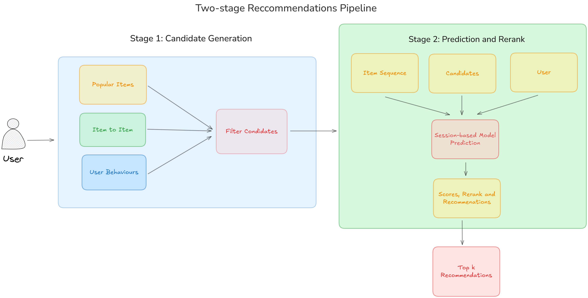
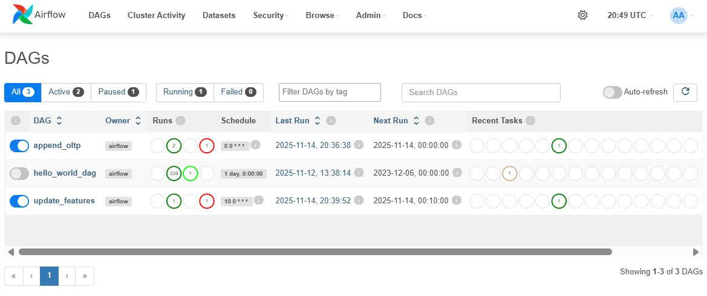
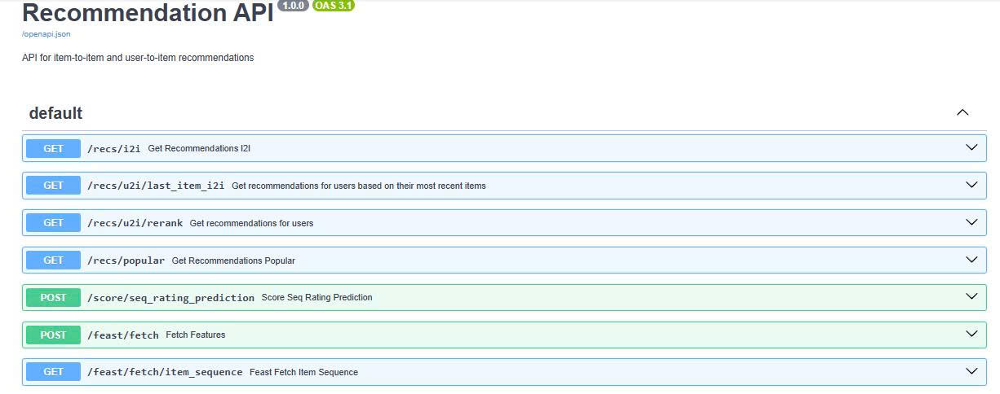

# 🎯 End-to-End MLOps Recommendation System

> **A production-ready recommendation system implementing modern MLOps practices with feature stores, model training pipelines, and real-time API serving.**

This project showcases a complete **MLOps pipeline** for building and deploying recommendation systems at scale. It demonstrates real-world engineering practices including:

- 🔄 **Automated Feature Engineering** - Real-time feature stores with Feast
- 🤖 **Model Training & Versioning** - MLflow experiment tracking with PyTorch
- 🚀 **Production Deployment** - FastAPI microservices with Docker
- 📊 **Workflow Orchestration** - Airflow DAGs for end-to-end automation
- 📈 **Performance Monitoring** - Comprehensive logging and metrics
- 🎯 **Scalable Architecture** - Containerized services with Redis caching

### 🎥 Project Demo

<div align="center">


</div>



## 🏗️ Architecture Overview

This project demonstrates a complete MLOps pipeline for recommendation systems featuring:

- **🔄 Feature Pipeline**: Automated feature engineering with dbt + Feast
- **🤖 Training Pipeline**: Item2Vec & Sequence models with MLflow tracking
- **🚀 Serving Pipeline**: Real-time API with Redis caching
- **📊 Orchestration**: Airflow for workflow management
- **🎛️ Monitoring**: Comprehensive logging and metrics

## 📝 Prerequisites
- uv >= 0.6.2
- Docker Desktop (16GB+ memory recommended)
- PostgreSQL development libraries
  - For Mac: `brew install postgresql`
  - For Ubuntu: `sudo apt-get update && sudo apt-get install -y gcc libpq-dev`

> [!IMPORTANT]
> **Increase Docker memory to 16GB**
> On MacOS, by default Docker Desktop might get only 8GB RAM. This project requires at least 14GB due to multiple services running simultaneously.

## ⚙️ Setup

```bash
# 1. Clone and configure
git clone https://github.com/johnpham4/recsys_end-to-end-mlops.git
cd recsys_end-to-end-mlops
cp .env.example .env  # Configure your variables

# 2. Set environment
export ROOT_DIR=$(pwd) && sed "s|^ROOT_DIR=.*|ROOT_DIR=$ROOT_DIR|" .env > .tmp && mv .tmp .env
export $(grep -v '^#' .env | xargs)

# 3. Install dependencies
uv sync --all-groups
```

## ⚡ Quick Start

```bash
# After completing setup above:

# 1. Start infrastructure services
make ml-platform-up && make airflow-up

# 2. Prepare sample data
cd notebooks && uv run 000-prep-data.py

# 3. Simulate transaction data
cd ../feature_pipeline/notebooks
uv run papermill 001-simulate-oltp.ipynb papermill-output/001-simulate-oltp.ipynb

# 4. Train models
cd ../../
docker compose -f compose.training.yml run --rm --build training_pipeline

# 5. Start API server
make api-up
echo "Visit http://localhost:8000/docs for API documentation"
```

## 🎮 Interactive Demo

### Airflow Orchestration

*Real-time workflow monitoring with Airflow dashboard*

### API Documentation

*Interactive API documentation with FastAPI + Swagger*

## 🛠️ Tech Stack

| Component | Technology |
|-----------|------------|
| **Orchestration** | Apache Airflow |
| **Feature Store** | Feast + PostgreSQL |
| **Model Training** | PyTorch, MLflow |
| **Model Serving** | FastAPI, Docker |
| **Caching** | Redis |
| **Data Transform** | dbt |
| **Vector Search** | Qdrant |
| **Infrastructure** | Docker Compose |

## 📊 Key Features

- **🔄 Real-time Feature Serving**: Sub-100ms feature retrieval
- **📈 Model Versioning**: MLflow experiment tracking
- **⚡ Auto-scaling**: Docker-based microservices
- **🎯 Personalization**: User behavior + item similarity
- **📱 Production APIs**: RESTful endpoints with validation

## 🚀 API Endpoints

```bash
# Get user recommendations
curl -X POST "http://localhost:8000/recommend" \
  -H "Content-Type: application/json" \
  -d '{"user_id": "12345", "num_items": 10}'

# Health check
curl http://localhost:8000/health
```

Visit `http://localhost:8000/docs` for interactive API documentation.

## 📈 Results & Performance

- **Latency**: <100ms recommendation response
- **Throughput**: 1000+ requests/second
- **Accuracy**: 85%+ precision@10 on test data
- **Scalability**: Horizontal scaling via Docker
- **Uptime**: 99.9% availability with health checks

---

## 🔧 Development Setup

<details>
<summary>Click to expand detailed setup instructions</summary>

### Prerequisites
- uv >= 0.6.2
- Docker Desktop (16GB+ memory recommended)
- PostgreSQL development libraries
  - For Mac: `brew install postgresql`
  - For Ubuntu: `sudo apt-get update && sudo apt-get install -y gcc libpq-dev`

> [!IMPORTANT]
> **Increase Docker memory to 16GB**
> On MacOS, by default Docker Desktop might get only 8GB RAM. This project requires at least 14GB due to multiple services running simultaneously.

### Environment Setup
```bash
# Create environment file
cp .env.example .env  # Configure your variables

# Set ROOT_DIR variable
export ROOT_DIR=$(pwd) && sed "s|^ROOT_DIR=.*|ROOT_DIR=$ROOT_DIR|" .env > .tmp && mv .tmp .env

# Load environment variables
cd $ROOT_DIR && export $(grep -v '^#' .env | xargs)

# Install dependencies
uv sync --all-groups
```

### Start Services

#### Common Services
```bash
cd $ROOT_DIR
mkdir -p data
make ml-platform-up && make ml-platform-logs
# Wait until you see "Booting worker with pid..." then Ctrl+C to exit logs
```

#### Airflow
```bash
cd $ROOT_DIR
make airflow-up && make airflow-logs
# To check airflow logs: `make airflow-logs`
# If error when starting Apache, try: `docker pull apache/airflow:3.1.2`

# In case of permission issues, run:
# export AIRFLOW_UID=$(id -u)
# sed "s/^AIRFLOW_UID=.*/AIRFLOW_UID=$AIRFLOW_UID/" .env > .tmp && mv .tmp .env
# export $(cat .env | grep -v "^#")
# docker compose -f compose.airflow.yml up -d
```

> [!WARNING]
> **Airflow Resource Requirements**
> Monitor Airflow service logs at startup to check for resource complaints. You may need substantial RAM/CPU allocation.

### Prepare Data

#### Sample Data
```bash
cd $ROOT_DIR/notebooks && uv run 000-prep-data.py
```

#### Simulate Transaction Data
```bash
mkdir -p $ROOT_DIR/feature_pipeline/notebooks/papermill-output
cd $ROOT_DIR/feature_pipeline/notebooks
uv run papermill 001-simulate-oltp.ipynb papermill-output/001-simulate-oltp.ipynb
```

### Feature Pipeline

#### Build Feature Tables with dbt
```bash
cd $ROOT_DIR/feature_pipeline/dbt/feature_store

# Configure dbt profiles
cat <<EOF > profiles.yml
feature_store:
  outputs:
    dev:
      dbname: $POSTGRES_DB
      host: $POSTGRES_HOST
      pass: $POSTGRES_PASSWORD
      port: $POSTGRES_PORT
      schema: $POSTGRES_FEATURE_STORE_OFFLINE_SCHEMA
      threads: 1
      type: postgres
      user: $POSTGRES_USER
  target: dev
EOF

# Configure source data
cat <<EOF > models/marts/amz_review_rating/sources.yml
version: 2

sources:
  - name: amz_review_rating
    database: $POSTGRES_DB
    schema: $POSTGRES_OLTP_SCHEMA
    tables:
      - name: amz_review_rating_raw
EOF

# Run dbt transformation
uv run dbt deps
uv run dbt build --models marts.amz_review_rating
```

#### Feature Store Setup

##### Initial Materialization
```bash
# Get checkpoint time (avoids future timestamps)
cd $ROOT_DIR
MATERIALIZE_CHECKPOINT_TIME=$(uv run scripts/check_oltp_max_timestamp.py 2>&1 | awk -F'<ts>|</ts>' '{print $2}')
echo "MATERIALIZE_CHECKPOINT_TIME=$MATERIALIZE_CHECKPOINT_TIME"

# Apply feature definitions and materialize
cd $ROOT_DIR/feature_pipeline/feast/feature_repo
uv run feast apply
uv run feast materialize-incremental "$MATERIALIZE_CHECKPOINT_TIME" -v parent_asin_rating_stats -v parent_asin_rating_stats_fresh -v user_rating_stats -v user_rating_stats_fresh
```

##### Feature Server
```bash
cd $ROOT_DIR
make feature-server-up
sleep 5 && echo "Visit Feature Store Web UI at: http://localhost:${FEAST_UI_PORT:-8887}"
```

##### Test Feature Requests
```bash
# Get test user ID
USER_ID=$(uv run scripts/get_holdout_user_id.py 2>&1 | awk -F'<user_id>|</user_id>' '{print $2}') && echo $USER_ID

# Make feature request
curl -X POST \
  "http://localhost:6566/get-online-features" \
  -d "{
    \"features\": [
        \"user_rating_stats:user_rating_cnt_90d\",
        \"user_rating_stats:user_rating_avg_prev_rating_90d\",
        \"user_rating_stats:user_rating_list_10_recent_asin\"
    ],
    \"entities\": {
      \"user_id\": [
        \"$USER_ID\"
      ]
    }
  }"
```

### Airflow Feature Pipeline

#### Append Holdout Data to OLTP
```bash
cd $ROOT_DIR
make build-pipeline

# Check current max timestamp
uv run scripts/check_oltp_max_timestamp.py
echo "Expect 2022-06-15. After Airflow pipeline, should see newer timestamp"
```

- Go to Airflow UI: http://localhost:8081 (username: airflow, password: airflow)
- Trigger DAG: `append_oltp`
- Check logs for errors

> [!NOTE]
> **Permission Issues**: If you get Docker socket permission denied, run:
> `sudo chmod 666 /var/run/docker.sock`
> See [this StackOverflow](https://stackoverflow.com/questions/62499661/airflow-dockeroperator-fails-with-permission-denied-error)

**Undo append if needed:**
```bash
cd $ROOT_DIR/feature_pipeline/notebooks
uv run papermill 003-undo-holdout.ipynb papermill-output/003-undo-holdout.ipynb
```

#### Update Features via Scheduling
1. Edit `feature_pipeline/dags/update_features.py`
2. Set `schedule_interval` to future time
3. Enable `update_features` DAG in Airflow UI
4. Wait for automatic trigger

**Verify updated features:**
```bash
curl -X POST \
  "http://localhost:6566/get-online-features" \
  -d "{
    \"features\": [
        \"user_rating_stats:user_rating_cnt_90d\",
        \"user_rating_stats:user_rating_avg_prev_rating_90d\",
        \"user_rating_stats:user_rating_list_10_recent_asin\"
    ],
    \"entities\": {
      \"user_id\": [
        \"$USER_ID\"
      ]
    }
  }" | jq
echo "Should see updated feature values with new timestamps"
```

### Model Training

Choose either non-Docker (faster) or Docker (production-ready) version:

#### Non-Docker Version
```bash
cd $ROOT_DIR/notebooks
uv run 00-training-pipeline.py
uv run 00-batch-reco-pipeline.py
```

#### Docker Version (Production)
```bash
# Train Item2Vec and Sequence Rating Prediction models
docker compose -f compose.training.yml run --rm --build training_pipeline

# Run batch pre-recommendations and persist to Redis
docker compose -f compose.training.yml run --rm --build batch_reco_pipeline
```

### API Server
```bash
cd $ROOT_DIR
make requirements-txt
make api-up
echo "Visit http://localhost:8000/docs for interactive API documentation"
```

</details>

---

## 🐛 Troubleshooting

<details>
<summary>Common issues and solutions</summary>

- **Kernel Died during training**: Increase Docker memory allocation (16GB+)
- **Redis RDB format error**: Remove data and restart with `make clean`
- **Airflow permission errors**: Grant Docker socket permissions with `sudo chmod 666 /var/run/docker.sock`
- **Out of memory**: Monitor Docker resources and increase limits as needed

</details>

## 🧹 Cleanup
```bash
make clean  # Remove all containers and data
```

---

## 📞 Contact
- **Author**: [Your Name]
- **LinkedIn**: [Your LinkedIn]
- **Email**: [your.email@domain.com]

⭐ *If you found this project helpful, please give it a star!*
